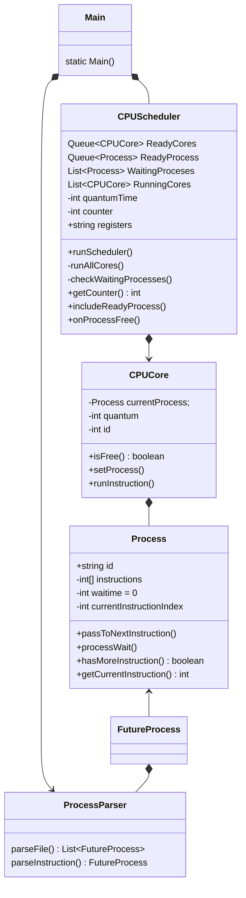

## Explicação de execução:
1. Rode o script java no arquivo Main.
    
   O arquivo main deverá:
- Ler o process.txt dentro de lib
- Realizar o parser das instruções no process
- Gerar um output.txt com base nos dados da execução dos processos

2. Rode o script python para visualizar o formato do diagrama de gantt estraido do output.txt.
    
   O arquivo python deverá:
- Ler o output.txt
- Separar os process por id
- Separar os pares de execução e interrupção do process
- Exibir os dados de execução em um diagrama de gantt

## Explicação dos componentes:
A execução principal está separada entre as classes:
- Process: é o processo em si, possui uma lista de inteiros que representam uma instrução,
  o valor desses números representam o tempo em que esse processo deve esperar após a execução dessa instrução.
  Ou seja, se uma instrução possuir valor 0, essa instrução não faz requisições ao kernel, portanto o processo não precisa esperar quando roda esse tipo de instrução.
  Se uma instrução tiver um valor maior que 0, por exemplo 5, o processo deve esperar 5 ciclos para poder voltar à executar
- CPUCore: O Cpu core representa uma núcleo em uma CPU, o core é responsável por executar os processos.
O core também é responsável por colocar os processos em sleep quando as condições de parada são antigindas:
Quando o Quantum chega a zero, quando uma instrução de acesso ao kernel é executada ou quando o processo finaliza.
- CPUScheduler: é responsável por gerenciar os CPU Cores e os processos em espera, compoe a parte mais complexa do código.
O Scheduler é responsável por armazenar os cores e os processos que estão esperando na fila para execução, é responsável por executar os processos dentro do CpuCore e por fazer com que os processos em espera de fato esperem.

Além dos componentes principais, temos outras classes e interfaces complementares:
- FutureProcess: representa um processo que ainda não entrou em execução, armazena o processo que será executado e o tempo em que ele deve ser colocado na pilha de execução
- ProcessParser: responsável por converter os processos descritos no Process.txt em um objeto do tipo Process
- Main: A main instancia os CPUCores, o scheduler, define o quantum do Core, roda o scheduler dentro de um while loop e envia os future process para a pilha de execução no tempo correto

